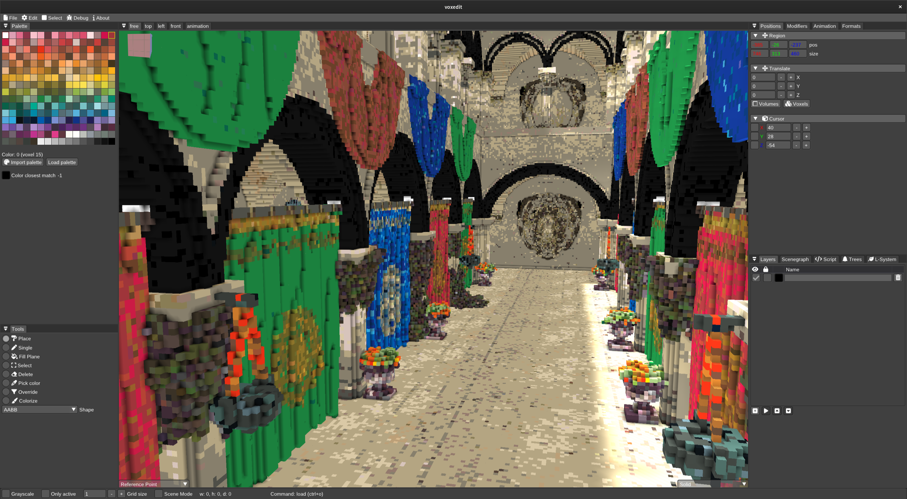

# Voxelized meshes

## Sponza

[Sponza gltf source](https://github.com/KhronosGroup/glTF-Sample-Models/tree/master/2.0/Sponza)

Voxelized with [vengi-voxconvert](https://github.com/mgerhardy/vengi) 0.0.21-dev (0.3 scale took ~30 minutes)

```sh
./vengi-voxconvert -set voxformat_scale 0.3 --input ~/glTF-Sample-Models/2.0/Sponza/glTF/Sponza.gltf --output ~/sponza.qb
```

There are still a few texture lookup errors somewhere hidden - but all in all the result is quite nice.



# Links

[mgerhardy/vengi](https://github.com/mgerhardy/vengi)
